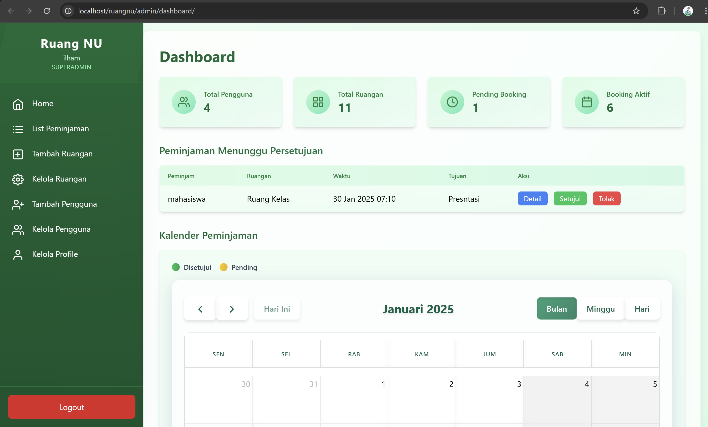

# RuangNU

**RuangNU** adalah aplikasi web berbasis PHP untuk memfasilitasi sistem peminjaman ruangan di Universitas Nahdlatul Ulama Yogyakarta. Aplikasi ini dirancang untuk memberikan pengalaman pengguna yang mudah dan responsif dengan fitur manajemen ruangan, autentikasi pengguna, dan sistem persetujuan peminjaman.


## Developer
- Ilham Kurniawan
- Mohammad Fattachul 'Alim
- Adyana Wabilhadi Chanigia

## Fitur Utama

- **Landing Page:** Tampilan awal untuk pengenalan aplikasi.
- **Autentikasi Pengguna:** Login dan pengelolaan akun dengan peran pengguna (Admin, Mahasiswa).
- **Manajemen Ruangan:** Tambah, edit, dan hapus data ruangan.
- **Sistem Peminjaman:** Proses peminjaman ruangan dengan status *pending*, *approved*, atau *rejected*.
- **Dashboard:** Statistik peminjaman dan ruangan dengan visualisasi data.
- **Desain Responsif:** Menggunakan TailwindCSS untuk antarmuka yang menarik dan responsif.

## Teknologi yang Digunakan

- **Backend:** PHP dengan MySQL untuk penyimpanan data.
- **Frontend:** HTML, CSS (TailwindCSS), JavaScript.
- **Komponen UI:** Feather Icons untuk ikon interaktif.
- **Database:** MySQL dengan tabel `users`, `rooms`, dan `bookings`.

## Screenshots

### Landing Page


### Dashboard


### Kalender


### Login


### Booking


### Riwayat Booking


## Instalasi

1. **Clone Repository**
   ```bash
   git clone https://github.com/IlhamKurniawanJateng/ruangnu.git
   cd ruangnu
Konfigurasi Database

Buat database baru di MySQL.
Import file database.sql ke database Anda.
Sesuaikan konfigurasi database di config/db.php.
Jalankan Server

Gunakan server PHP bawaan atau aplikasi seperti Laragon/XAMPP.
Akses aplikasi melalui http://localhost/ruangnu.
Kontribusi
Kontribusi sangat terbuka! Silakan buat pull request atau laporkan masalah melalui Issues.

Lisensi
Proyek ini dilisensikan di bawah MIT License.

© 2025 RuangNU Development Team

markdown
Copy
Edit


